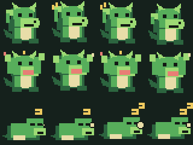

# AI-Code-Pager（AI 传呼机）

AI-Code-Pager 是一套面向 nRF52840 ProMicro 兼容板的 Zephyr 固件与 Web Bluetooth 上位机。设备在电脑侧同时表现为：

- 标准 BLE HID 键盘：可直接控制 Codex、Claude Code、WorkBuddy 等桌面软件；
- 自定义 BLE 外设：浏览器可以实时改键、推送 AI 文本、切换宠物动作并接收物理输入事件；
- 复古电子宠物终端：1.9 寸 ST7789 屏幕左侧播放绿色像素幼龙，右侧显示信息流和审批菜单。



## 已实现功能

- Zephyr RTOS + nRF52840 自定义板级配置；
- ST7789V3、170×320、4 线 SPI，横屏逻辑分辨率 320×170；
- 6 个独立按键 + RKJXT 上/下/左/右/按压 + A/B 旋转，共 13 个可映射逻辑输入；
- BLE HID 键盘，支持普通键和 Ctrl/Shift/Alt/GUI 修饰键；
- 自定义 GATT 服务，支持实时改键、保存、恢复默认、文本推送、宠物状态和输入事件；
- Settings/NVS 持久化键位；
- LVGL 左右分栏界面，使用约 12 KiB 局部绘制缓冲；
- 3 组 × 4 帧、80×80 的透明 PNG：挠头、欢呼、睡觉；
- PNG 预烘焙为 LVGL `TRUE_COLOR` RGB565 C 数组，运行时不解码；
- 无构建依赖的 Web Bluetooth 上位机。

## 硬件与接线

屏幕规格来自工作区内的 `ZJY190S0800TG01` 模组手册：3.3 V、ST7789V3、170(H)×320(V)、4-SPI。模组 8 针定义如下：

| 屏幕针脚 | 功能 | 默认 nRF52840 GPIO |
|---|---|---:|
| 1 GND | 地 | GND |
| 2 VCC | 受 P0.13 使能的 3.3 V | VCC |
| 3 SCL | SPI 时钟 | P1.13（D15） |
| 4 SDA | SPI MOSI | P0.10（D16） |
| 5 RES | 低有效复位 | P1.00 |
| 6 DC | 数据/命令 | P0.24 |
| 7 CS | 低有效片选 | P0.22 |
| 8 BLK | 背光控制，高亮/低灭 | P0.06（D1） |

> 当前 overlay 针对 `ProMicroNRF52840Foot.jpg` 中的 SuperMini 板。P0.13 和 D1/P0.06 均通过 GPIO Hog 在开机时立即拉高：P0.13 使能板边 VCC 供电，D1/P0.06 使能屏幕 BLK 背光。请勿将屏幕接到 BATTERY+ 或 BOOST。

默认输入映射：

| 物理输入 | GPIO | 默认 HID |
|---|---:|---|
| K1…K4 | P0.02…P0.05 | F13…F16 |
| K5、K6 | P0.28、P0.29 | F17、F18 |
| RKJXT 上、下 | P0.30、P0.31 | ↑、↓ |
| RKJXT 左、右、按压 | P1.01、P1.02、P1.04 | ←、→、Enter |
| RKJXT A、B | P1.06、P1.07 | Page Up / Page Down |

所有按钮和 RKJXT 触点均按“GPIO 与 GND 短接”连接，固件使用内部上拉。RKJXT 的具体公共端与 A/B/方向脚名称请以所购型号的数据表为准。

> 重要：市面上的 “nRF52840 ProMicro” 包括 nice!nano、SuperMini 和多种克隆板，丝印与可引出 GPIO 并不完全一致。以上是固件默认的 SoC GPIO 编号，不是保证通用的板边丝印。焊接前请对照你的主控原理图，只需修改 [boards/promicro_nrf52840.overlay](boards/promicro_nrf52840.overlay) 即可适配，不需要改业务代码。

## 环境与构建

### GitHub Actions 在线编译（推荐）

仓库已包含 [.github/workflows/firmware.yml](.github/workflows/firmware.yml) 和 [west.yml](west.yml)，不需要在电脑上安装 Zephyr：

1. 将整个工程推送到 GitHub 仓库；
2. 打开仓库的 **Actions → Firmware Build**；
3. 点击 **Run workflow**，或直接向 `main` / `master` 推送提交；
4. 等待 `Source checks` 与 `Zephyr 3.7.1 / nRF52840` 两个任务变绿；
5. 在该次运行页面底部下载 `AI-Code-Pager-<commit>` artifact。

压缩包包含：

| 文件 | 用途 |
|---|---|
| `AI-Code-Pager.uf2` | 拖入支持 UF2 的 nRF52840 ProMicro bootloader |
| `AI-Code-Pager.hex` | J-Link、nrfjprog 或其他 SWD 工具 |
| `AI-Code-Pager.bin` | 裸二进制升级流程 |
| `AI-Code-Pager.elf` | 调试与符号分析 |
| `AI-Code-Pager.map` | Flash/RAM 占用分析 |
| `zephyr.config` | 实际生效的 Kconfig |
| `zephyr.dts` | 实际展开后的设备树与引脚 |
| `SHA256SUMS.txt` | 下载后校验产物完整性 |

工作流固定使用 Zephyr `v3.7.1` 和官方 Zephyr CI 容器，首次运行会下载完整 west workspace；之后通过 Actions cache 复用。若固件构建失败，工作流还会尝试上传 `AI-Code-Pager-build-diagnostics-*`，便于根据 `.config`、DTS 和 CMake 日志定位错误。

> 在线编译能验证软件配置，但不能自动确认你手中 ProMicro 克隆板的丝印映射和 bootloader 分区。第一次刷写前仍应核对 GPIO 与 bootloader 起始地址。

### 本地构建

推荐 Zephyr 3.7 LTS 或兼容的 nRF Connect SDK。首次准备独立 Zephyr workspace：

```bash
python3 -m venv .venv
source .venv/bin/activate
pip install west
west init zephyr-workspace
cd zephyr-workspace
west update
west zephyr-export
pip install -r zephyr/scripts/requirements.txt
```

将本仓库放在 workspace 中后构建：

```bash
west build -p always -b promicro_nrf52840/nrf52840 path/to/AI-Code-Pager \
  -- -DBOARD_ROOT=path/to/AI-Code-Pager
```

部分使用旧硬件模型的 Zephyr 版本将目标名显示为 `promicro_nrf52840`；以 `west boards | grep promicro` 的结果为准。

使用 J-Link/SWD：

```bash
west flash
```

使用带 UF2 bootloader 的 ProMicro 克隆板时，将生成的 HEX 转为与你的 bootloader 匹配的 UF2，或使用该板厂商提供的 UF2 runner。仓库默认 Flash 分区按常见 Adafruit/nice!nano bootloader 布局：应用从 `0x26000` 开始，末尾保留 bootloader，`0xEC000` 起的 32 KiB 用于 NVS。若你的板使用裸芯片、MCUboot 或不同 SoftDevice/bootloader，必须同步修改 [promicro_nrf52840.dts](boards/arm/promicro_nrf52840/promicro_nrf52840.dts) 的分区后再刷写。

## 打开 Web 上位机

Web Bluetooth 需要安全上下文；本机 `localhost` 被浏览器视为安全来源。不要直接双击 HTML 文件。

```bash
python3 -m http.server 8765
```

然后在 Chrome 或 Edge 打开：

```text
http://localhost:8765/web/
```

点击“连接传呼机”，选择 `AI-Code-Pager`。Safari、Firefox 和 iOS 浏览器目前不提供完整 Web Bluetooth 支持。

改键下拉框会立即写入 RAM；点击“保存到设备”才写入 NVS。建议 6 个独立键保留为 F13–F18，再由电脑上的自动化工具映射为“批准”“拒绝”“显示差异”“停止任务”等操作，可以避开普通输入键冲突。

### PC 命令行桥接

需要让 Codex、Claude Code 或本地自动化脚本主动更新传呼机时，可使用 Bleak CLI：

```bash
python3 -m venv host/.venv
host/.venv/bin/pip install -r host/requirements.txt

# AI 开始思考
host/.venv/bin/python host/pager_cli.py text --pet scratch \
  "Codex is reviewing the patch..."

# 需要用户审批
host/.venv/bin/python host/pager_cli.py text --pet point \
  "Approval required: press the center switch."

# 构建成功
host/.venv/bin/python host/pager_cli.py text --pet cheer \
  "Build passed. 42 tests OK."

# 监听物理输入，供上层脚本消费
host/.venv/bin/python host/pager_cli.py listen
```

`pager_cli.py --help` 可查看改键、读取键位、恢复默认等命令。BLE 外设当前只允许一个连接，因此使用 CLI 前请先断开 Web 上位机。macOS 首次运行时需要允许终端访问蓝牙。

## 资源与渲染策略

- 屏幕完整 RGB565 帧缓冲需要约 106 KiB；本工程不分配全帧缓冲；
- `CONFIG_LV_Z_VDB_SIZE=12` 使用约 12% 屏幕大小的单局部绘制缓冲（RGB565 下约 13 KiB）；
- 每帧宠物图为 80×80×2 = 12.5 KiB，12 帧总计 150 KiB，均为只读常量，驻留 Flash；
- PNG 仅保留为美术源文件，固件链接的是 [pet_animations.c](src/assets/pet_animations.c)；
- UI 更新通过消息队列进入主线程，BLE 回调与 GPIO work item 不直接调用 LVGL；
- 左侧 Animimg 只使宠物包围盒失效，右侧文本变化也只刷新对应对象，避免全屏重绘。

传输层接受 UTF-8，但默认 Montserrat 字库只覆盖拉丁字符，以控制 Flash 占用；固件信息流建议先使用英文/ASCII。若需要显示任意中文，请用 LVGL Font Converter 生成所需中文字形并在 `src/ui.c` 中替换字体。

重新生成素材与 C 数组：

```bash
python3 tools/generate_pet_assets.py
```

脚本需要 Pillow。美术源文件位于 `assets/pet/<动作>/00.png…03.png`，生成文件不要手工修改。

## BLE 自定义协议

服务与特征 UUID：

```text
Service 12345678-1234-5678-1234-56789abcdef0
RX      12345678-1234-5678-1234-56789abcdef1  Write / Write Without Response
TX      12345678-1234-5678-1234-56789abcdef2  Notify
```

数据包为紧凑二进制格式：

| 方向 | 操作码 | 载荷 |
|---|---:|---|
| PC→设备 | `01` | `input_id, modifiers, usage`，实时改键 |
| PC→设备 | `02` | 无，保存键位 |
| PC→设备 | `03` | 无，恢复默认 |
| PC→设备 | `04` | 无，请求键位表 |
| PC→设备 | `10` | `flags, UTF-8 bytes`；flags bit0=开始、bit1=结束 |
| PC→设备 | `11` | `state`：0 挠头、1 兼容状态（回退为挠头）、2 欢呼、3 睡觉 |
| PC→设备 | `20` | 无，ping |
| 设备→PC | `80` | `input_id, pressed` |
| 设备→PC | `81` | `request_opcode, errno` |
| 设备→PC | `82` | `count, (modifiers, usage) × count` |

HID `modifiers` 使用标准位：bit0 Left Ctrl、bit1 Left Shift、bit2 Left Alt、bit3 Left GUI，bit4…bit7 为右侧修饰键。`usage` 使用 USB HID Usage Tables 的 Keyboard/Keypad 页。

## 工程结构

```text
boards/                  自定义 nRF52840 板与 GPIO/display overlay
src/                     BLE、HID、输入、存储、协议与 LVGL UI
src/assets/              预烘焙 RGB565 C 数组
assets/pet/              12 张透明 PNG 与预览图
tools/                   可复现素材生成/转换脚本
web/                     Web Bluetooth 上位机
host/                    PC 端 Bleak CLI，可接入 agent hooks/自动化脚本
屏幕模块手册/            原始模组和 ST7789 资料
```

## 上电验收顺序

1. 不接屏幕，先通过手机或电脑确认设备广播 `AI-Code-Pager`；
2. 接屏幕后首先应显示 1.5 秒红/绿/蓝/白色块，然后进入 320×170 主界面；若图像偏移，优先调整 overlay 中 `x-offset` / `y-offset`；
3. 逐个短接输入 GPIO 到 GND，在 Web 事件区确认输入 ID；
4. 配对为蓝牙键盘，在键盘测试器确认 F13–F18、方向与 Enter；
5. 修改一个键并保存，断电重启后确认键位仍保留；
6. 推送英文/ASCII 文本并依次切换挠头、欢呼和睡觉三组动画；兼容状态 1 会回退为挠头。

目前仓库已经通过素材重建、Python/JavaScript 语法检查、GitHub Actions 配置静态检查和浏览器布局验收。此工作区没有安装 Zephyr SDK，因此应由新增的 GitHub Actions 工作流完成首次固件编译；实机电气验收仍需在实际 PCB 上完成。
